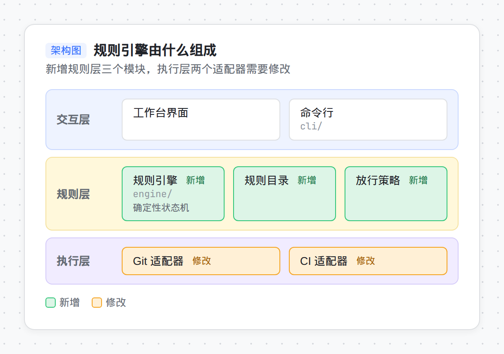

# skills

[English](#english) | [中文](#中文)

## English

Agent skills that follow the open [Agent Skills](https://agentskills.io) format. They work with Claude Code, Codex, Cursor, and other agents that support `SKILL.md`.

| Skill | Description |
| --- | --- |
| [`dev-principles`](skills/dev-principles/SKILL.md) | Development principles: ubiquitous language, tracer bullets, deep modules, unidirectional dependencies |
| [`frontend-dev`](skills/frontend-dev/SKILL.md) | React frontend conventions: Vite, Tailwind v4, shadcn/ui, TanStack Query, Zustand, project layout |
| [`diagram`](skills/diagram/SKILL.md) | Feishu-whiteboard-style diagrams: layered architecture, flowchart, sequence, comparison matrix |



The skill content is written in Chinese. Skill descriptions are bilingual so that agents can select the skills in either language.

### Install

Use the [`skills`](https://github.com/vercel-labs/skills) CLI for any supported agent:

```bash
npx skills add z2014/skills -g
```

#### Claude Code

Add this marketplace, then install a skill by name. `diagram` is its own plugin. The same catalog also has `dev-principles`, `frontend-dev`, and a combined `skills` plugin.

```
/plugin marketplace add z2014/skills
/plugin install diagram@z2014
/plugin install dev-principles@z2014
/plugin install frontend-dev@z2014
/plugin install skills@z2014
```

#### Codex

In Codex, invoke the built-in `$skill-installer` and ask it to install `https://github.com/z2014/skills/tree/main/skills/diagram`. That skill runs:

```bash
python3 "${CODEX_HOME:-$HOME/.codex}/skills/.system/skill-installer/scripts/install-skill-from-github.py" \
  --repo z2014/skills \
  --path skills/diagram
```

The script installs into `$CODEX_HOME/skills/diagram`, which is `~/.codex/skills/diagram` when `CODEX_HOME` is unset. The skill is available on the next turn; restart Codex if it does not appear.

To copy it yourself into the installer's destination:

```bash
git clone --depth 1 https://github.com/z2014/skills.git
mkdir -p "${CODEX_HOME:-$HOME/.codex}/skills"
cp -R skills/diagram "${CODEX_HOME:-$HOME/.codex}/skills/diagram"
```

The Agent Skills docs also load user skills from `$HOME/.agents/skills`. Use that directory the same way when it is where your Codex reads user skills:

```bash
mkdir -p "$HOME/.agents/skills"
cp -R skills/diagram "$HOME/.agents/skills/diagram"
```

#### Release zip

A tag named `<skill>-v<version>` (for example `diagram-v0.1.0`) publishes `<skill>-<version>.zip` on the GitHub Release for that tag. The archive root is `diagram/`.

```bash
curl -fsSL -o diagram-0.1.0.zip \
  https://github.com/z2014/skills/releases/download/diagram-v0.1.0/diagram-0.1.0.zip
unzip diagram-0.1.0.zip -d "${CODEX_HOME:-$HOME/.codex}/skills"
```

The same unzip works for `$HOME/.agents/skills`. To load the zip in Claude Code for one session, unpack it and point `--plugin-dir` at the `diagram` directory (it contains `.claude-plugin/plugin.json`):

```bash
unzip diagram-0.1.0.zip
claude --plugin-dir ./diagram
```

### Update

```bash
npx skills update -g
```

In Claude Code, run `/plugin marketplace update z2014`, then `/plugin update diagram@z2014` (or `skills@z2014` for the combined plugin).

### diagram 0.1.0

- Four diagram types: `layered-architecture`, `flowchart`, `sequence`, `comparison-matrix`.
- Mermaid fallback: `type: general` for other diagrams, `--mermaid` for the structured types, and a Feishu theme line when Python is unavailable.
- Stable element ids, rendered as `data-id`. Revisions keep existing ids and only mint ids for new elements.
- Comments anchor to the diagram, its version, and an element id, and include the element name plus the original text. Each comment gets one result: changed, declined with a reason, or needs a decision. Update the design first, then redraw. Only the commented element and its direct edges change.

### Optional: always apply the principles

Agents read skill descriptions in every session and load the full skill when a task matches. To require the skill for all non-trivial work, add this line to your global instructions (`~/.codex/AGENTS.md` or `~/.claude/CLAUDE.md`):

```markdown
- Before non-trivial feature work, cross-module changes, refactoring, or design review, use the `dev-principles` skill and follow its checklist.
```

### Sources

- Tracer bullets: *The Pragmatic Programmer*, David Thomas and Andrew Hunt
- Deep modules: *A Philosophy of Software Design*, John Ousterhout
- Ubiquitous language: *Domain-Driven Design*, Eric Evans
- Unidirectional dependencies: the Acyclic and Stable Dependencies Principles in *Agile Software Development: Principles, Patterns, and Practices*, and the Dependency Rule in *Clean Architecture*, Robert C. Martin

## 中文

遵循开放的 [Agent Skills](https://agentskills.io) 格式，可用于 Claude Code、Codex、Cursor 等支持 `SKILL.md` 的 Agent。

| Skill | 说明 |
| --- | --- |
| [`dev-principles`](skills/dev-principles/SKILL.md) | 开发原则 |
| [`frontend-dev`](skills/frontend-dev/SKILL.md) | React 前端开发规范 |
| [`diagram`](skills/diagram/SKILL.md) | 飞书画板风格画图规范 |


### 安装

使用 [`skills`](https://github.com/vercel-labs/skills) 命令行工具，适用于各类 Agent：

```bash
npx skills add z2014/skills -g
```

#### Claude Code

先添加本仓库的插件市场，再按名字安装。`diagram` 是独立插件。同一市场里还有 `dev-principles`、`frontend-dev`，以及打包全部 skill 的 `skills`。

```
/plugin marketplace add z2014/skills
/plugin install diagram@z2014
/plugin install dev-principles@z2014
/plugin install frontend-dev@z2014
/plugin install skills@z2014
```

#### Codex

在 Codex 里调用内置的 `$skill-installer`，让它安装 `https://github.com/z2014/skills/tree/main/skills/diagram`。这个 skill 会执行：

```bash
python3 "${CODEX_HOME:-$HOME/.codex}/skills/.system/skill-installer/scripts/install-skill-from-github.py" \
  --repo z2014/skills \
  --path skills/diagram
```

脚本把 skill 装到 `$CODEX_HOME/skills/diagram`。未设置 `CODEX_HOME` 时，也就是 `~/.codex/skills/diagram`。下一轮对话即可使用；如果没有出现，重启 Codex。

也可以自己复制到安装脚本使用的目录：

```bash
git clone --depth 1 https://github.com/z2014/skills.git
mkdir -p "${CODEX_HOME:-$HOME/.codex}/skills"
cp -R skills/diagram "${CODEX_HOME:-$HOME/.codex}/skills/diagram"
```

Agent Skills 文档还会从 `$HOME/.agents/skills` 加载用户 skill。Codex 从那里读取时，用同样的方式复制：

```bash
mkdir -p "$HOME/.agents/skills"
cp -R skills/diagram "$HOME/.agents/skills/diagram"
```

#### Release 压缩包

推送形如 `<skill>-v<version>` 的 tag（例如 `diagram-v0.1.0`）后，对应 GitHub Release 上会有 `<skill>-<version>.zip`。压缩包根目录是 `diagram/`。

```bash
curl -fsSL -o diagram-0.1.0.zip \
  https://github.com/z2014/skills/releases/download/diagram-v0.1.0/diagram-0.1.0.zip
unzip diagram-0.1.0.zip -d "${CODEX_HOME:-$HOME/.codex}/skills"
```

解压到 `$HOME/.agents/skills` 同样可以。在 Claude Code 里只想用这一次时，解压后用 `--plugin-dir` 指向 `diagram` 目录（里面有 `.claude-plugin/plugin.json`）：

```bash
unzip diagram-0.1.0.zip
claude --plugin-dir ./diagram
```

### 更新

```bash
npx skills update -g
```

在 Claude Code 中执行 `/plugin marketplace update z2014`，然后执行 `/plugin update diagram@z2014`（安装的是打包插件时，则执行 `/plugin update skills@z2014`）。

### diagram 0.1.0

- 四种图：`layered-architecture`（分层架构）、`flowchart`（流程图）、`sequence`（时序图）、`comparison-matrix`（方案对比矩阵）。
- Mermaid 兜底：其他图用 `type: general`；结构化类型可以加 `--mermaid`；没有 Python 时在 Mermaid 第一行加上飞书主题。
- 元素 id 稳定，并渲染成 `data-id`。修订时沿用已有 id，只给新元素分配新 id。
- 评论锚定在「哪张图、哪个版本、哪个元素 id」上，并带有元素名称和用户原文。每条评论只给一个结论：已改、不改（附原因）、或需要确认。先改设计，再重画图。只动被评论的元素和直接相关的连线，其余 id 保持不变。

### 可选：始终应用这些原则

Agent 在每次会话中都会读取 skill 的描述，并在任务匹配时加载完整内容。如果希望所有非琐碎工作都使用该 skill，在全局指令文件（`~/.codex/AGENTS.md` 或 `~/.claude/CLAUDE.md`）中加入：

```markdown
- 开始非琐碎的功能开发、跨模块修改、重构或设计评审前，调用 `dev-principles` skill 并按其清单执行。
```

### 来源

- 贯通路径（Tracer Bullet）：《程序员修炼之道》
- 深模块（Deep Modules）：《软件设计哲学》
- 统一语言（Ubiquitous Language）：《领域驱动设计》
- 单向依赖（Unidirectional Dependencies）：《敏捷软件开发：原则、模式与实践》中的无环依赖原则与稳定依赖原则，《架构整洁之道》中的依赖规则

## License

[MIT](LICENSE)
